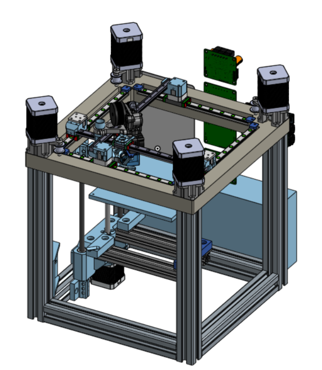

# Bricky

Small form factor (150mm x 150mm x 150mm) CrossXY 3D Printer with monolithic gantry frame and (mostly) metal mounting. This is a design which is incomplete, and will most likely never be actually constructed.

# Model Viewing
To view the CAD model, please copy and paste the link below into a new tab. If you do not do this, you may get a 403 Error.
https://cad.onshape.com/documents/8787b623c8ef54a15d9d564d/w/1d22123352daf545bd9f83b3/e/42c806a8db001b1bfee0b0ee?renderMode=0&uiState=6760689b6836ba1b7f672406

Bricky is named for its bricklike appearance. The primary design objective in design was stiffening and vibration reduction, via large extrusions, a solid plate gantry frame, and metal bracketry. Doing so does not directly reduce vibrations, especially with the material being aluminum (rather than a cast iron), but it should significantly increase the mass and stiffness compared to an aluminum extrusion or 3D printed bracketry, which should decrease the amplitude of vibrations.

# Kinematics
The CrossXY layout was chosen for its excellent performance and ease of using 4 motors for XY movement. It prominently features two rails which cross, and a motor driving the each end of both rails. The motor layout means that two belts of half the length of a same-size CoreXY printer is used, effectively quadrupling the total spring constant of the belts. Furthermore, the moments caused by the accelerating motors overall cancel out, unlike a 4-wheel drive CoreXY, since the axes are driven by a pair of motors which rotate in opposite directions. The weakness of this setup lies in the characteristic cross. The rails are unbacked in order to maximize lightweightness. Unfortunately, this also means that the rails are relatively susceptible to vibration, especially since the printhead is being driven *through* the rails. The rail orientation is nonetheless chosen to maximize the bending moment of the rais.

# Design Challenge
The Gantry Plate was a design challenge imposed upon myself. The monolithic top plate would mean the cancelling moments of the motors would be maximized, compared to most designs nowadays using multiple extrusions, along with the stiffness benefits, and the bonuses to precision that comes with machining an entire plate in one go compared to assembling by hand. The large amount of material missing from the inside of the gantry plate is saved and used in the construction of multiple of the brackets.
